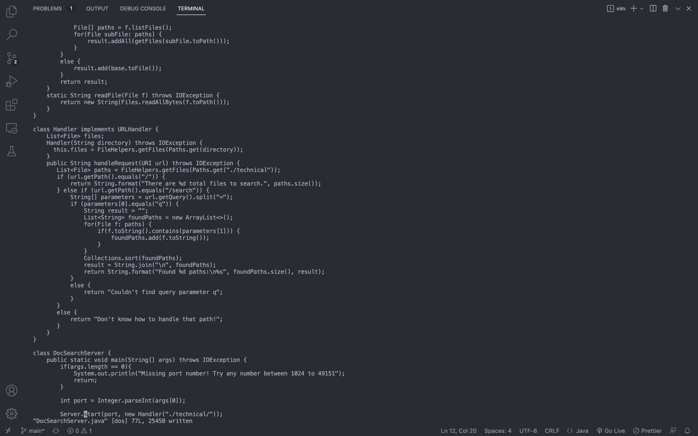

# Lab Report 4

# Part 1:

The task that I pick is: <br>
>In DocSearchServer.java, change the name of the start parameter of getFiles, and all of its uses, to instead be called base.

The shortest sequence of vim commands that I come up with to accomplish the task is: <br>
```:%s/start/base/gc<Enter>yyyq:w<Enter>```

Original File:
The cursor begins at the leftmost of the first line.


After pressing ```:```
Switches to the command line mode and the cursor moves to the command line and stopped right after the ```:```.


After pressing ```%s/start/base/gc```
The cursor still stays on the rightmost of the command line.


After pressing ```<Enter>```
The cursor moves to the first occurrence of the parameter "start". The command line prompts with "replace with base (y/n/a/q/l/^E/^Y)?".


After pressing ```y``` for the first time:
The cursor moves to the second occurrence of the parameter "start" while the first occurrence of the parameter "start" was replaced with the new parameter name "base".


After pressing ```y``` for the second time:
The cursor moves to the third occurrence of the parameter "start" while the second occurrence of the parameter "start" was replaced with the new parameter name "base".


After pressing ```y``` for the third time:
The cursor moves to the fourth occurrence of the word "start" but not the parameter "start", while the third occurrence of the parameter "start" was replaced with the new parameter name "base".


After pressing ```q```
The substitute command stops executing and switches back to normal mode. The cursor stays on the fourth occurrence of the word "start" with prompting at the bottom left that "3 substitutions on 3 lines".


After pressing ```:w<Enter>```
The changes that have been made to DocSearchServer.java were saved.


## Part 2
The edit task that I chose is: <br>
To fix the test in the TestDocSearch.java file in the skill-demo1 repository.

First option: The time that the first option takes is 55s.
>Once, start in Visual Studio Code and make the edit there, then scp the file to the remote server and run it there to confirm it works (you can just run bash test.sh on the remote to test it out). Consider having the appropriate scp command in your command history or easily copy-pasteable!

Second option: The time that the second option takes is 27s.
>Second, start already logged into a ssh session. Then, make the edit for the task you chose in Vim, then exit Vim and run bash test.sh.

The difficulties in the first option were to scp the edited file to the remote server and ssh back to the remote server to re-run the program which takes some extra time of typing rather than just editing the file on the remote server by using vim.

<br>

Which of these two styles would you prefer using if you had to work on a program that you were running remotely, and why?

I would prefer using the second style if I had to work on a program that was running remotely because it saves time from continuously logging into and logging out from the remote server, and scp edited files between local and remote.

<br>

What about the project or task might factor into your decision one way or another? (If nothing would affect your decision, say so and why!)

The factors that might affect my decision on using which option would be the number of files or lines that need to be edited. If the task were just easily editing one line to fix the test, I would just use vim to do it so. But if the task was to modify multiple files and edit tons of code, it would increase the potential of resulting in new bugs and errors, I would prefer using something like Visual Studio Code that would help me detect errors and bugs that I made and help me to fix them rather than using Vim.