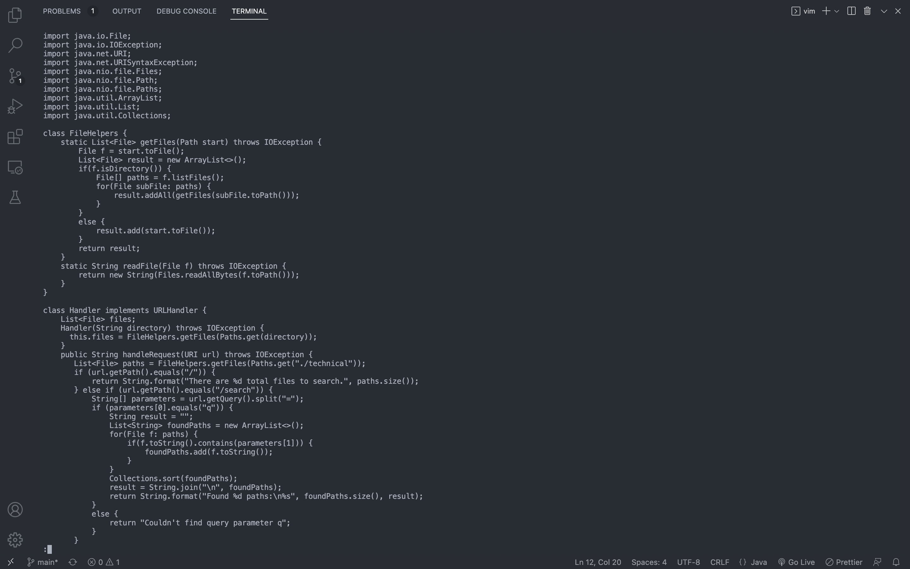

# Lab Report 4

# Part 1:

The task that I pick is: <br>
>In DocSearchServer.java, change the name of the start parameter of getFiles, and all of its uses, to instead be called base.

The shortest sequence of vim commands that I come up with to accomplish the task is: <br>
```:%s/start/base/gc<Enter>yyyq:w<Enter>```

Original File:
The cursor begin at the leftmost of the first line.


After pressing ```:```:
Switches to the command line mode and the cursor moves to the command line and stopped right after the ```:```.


After pressing ```%s/start/base/gc```:
The cursor still stays on the rightmost of the command line.


After pressing ```<Enter>```:
The cursor moves to the first occurrence of the parameter "start". The command line prompts with "replace with base (y/n/a/q/l/^E/^Y)?".


After pressing ```y``` for the first time:
The cursor moves to the second occurrence of the parameter "start" while the first occurrence of the parameter "start" was replaced with the new parameter name "base".


After pressing ```y``` for the second time:
The cursor moves to the third occurrence of the parameter "start" while the second occurrence of the parameter "start" was replaced with the new parameter name "base".


After pressing ```y``` for the third time:
The cursor moves to the fourth occurrence of the word "start" but not the parameter "start", while the third occurrence of the parameter "start" was replaced with the new parameter name "base".


After pressing ```q```:
The substitute command stops executing and the files swtiches back to the normal mode. With prompting at the bottom left that "3 substitutions on 3 lines".


After pressing ```:w<Enter>```:
The changes have been made to DocSearchServer.java were saved.


## Part 2

