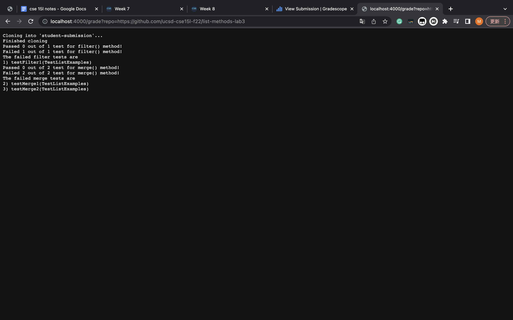
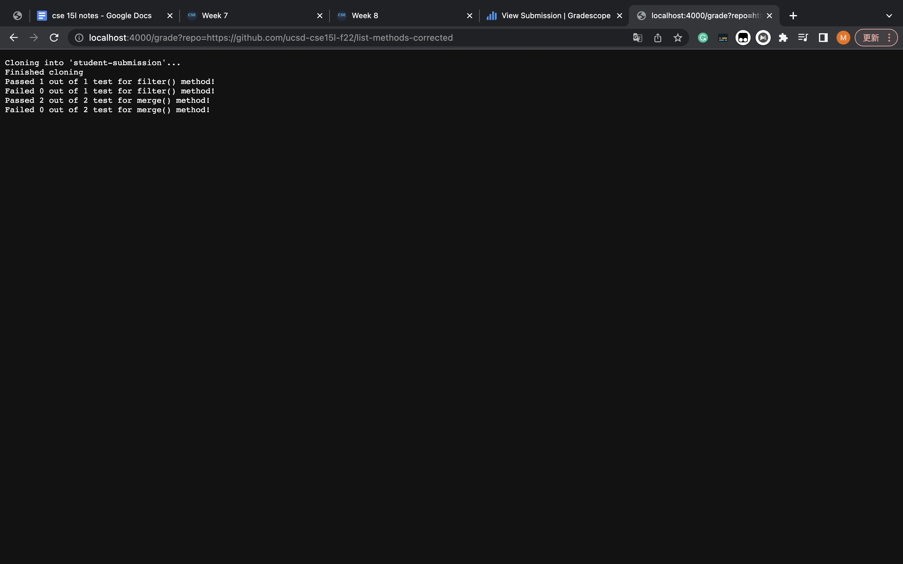
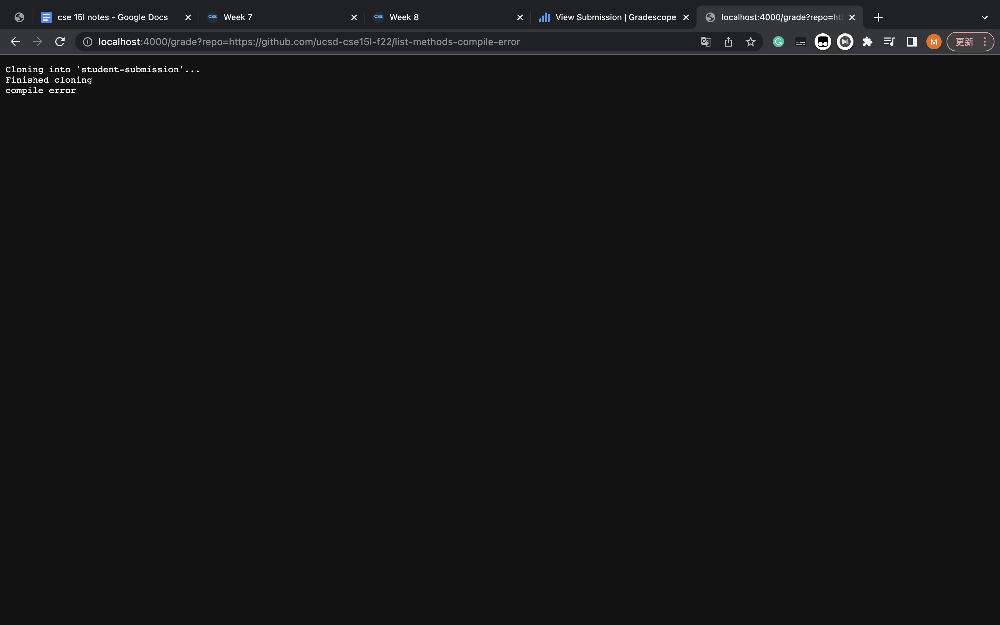

# Lab Report 5

## My ```grade.sh```:
```
# Create your grading script here

rm -rf student-submission
git clone $1 student-submission
echo 'Finished cloning'

cp TestListExamples.java student-submission
cp -R lib student-submission

cd student-submission

if [[ -e ListExamples.java ]]
then  
  javac -cp .:lib/hamcrest-core-1.3.jar:lib/junit-4.13.2.jar *.java 2> error.txt
else
  echo "wrong file submitted"
  exit 1
fi

[ -s error.txt ]

if [[ $? -eq 0 ]]
then
  echo "compile error"
  exit 1
else
  java -cp .:lib/hamcrest-core-1.3.jar:lib/junit-4.13.2.jar org.junit.runner.JUnitCore TestListExamples > output.txt
fi

filter_tests=$(grep -c "testFilter" TestListExamples.java)
merge_tests=$(grep -c "testMerge" TestListExamples.java)

filter_failed=$(grep -c "TestListExamples.testFilter" output.txt)
merge_failed=$(grep -c "TestListExamples.testMerge" output.txt)

filter_passed=$(echo "$filter_tests-$filter_failed" | bc)
merge_passed=$(echo "$merge_tests-$merge_failed" | bc)

filter_failed_tests=$(grep " testFilter" output.txt)
merge_failed_tests=$(grep " testMerge" output.txt)

echo "Passed $filter_passed out of $filter_tests test for filter() method!"
echo "Failed $filter_failed out of $filter_tests test for filter() method!"
if ! [[ filter_failed -eq 0 ]]
then
  echo "The failed filter tests are"
  echo "$filter_failed_tests"
fi

echo "Passed $merge_passed out of $merge_tests test for merge() method!"
echo "Failed $merge_failed out of $merge_tests test for merge() method!"
if ! [[ merge_failed -eq 0 ]]
then
  echo "The failed merge tests are"
  echo "$merge_failed_tests"
fi
```

### student submissions 1:
which has the same code as the starter from lab 3


### student submissions 2:
which has the methods corrected


## student submissions 2 trace:
```
# Create your grading script here

rm -rf student-submission
```
The ```rm -rf``` command is used to remove the previous ```student-submission``` directory.

```
git clone $1 student-submission
echo 'Finished cloning'
```
The ```git clone``` command is used to clone the student submission where the URL is taken in as the parameter $1 and stored in a new directory called ```student-submission```. The ```echo``` command prints out ```Finished cloning``` to the terminal.

```
cp TestListExamples.java student-submission
cp -R lib student-submission

cd student-submission
```
The ```cp``` command copies the file ```TestListExample.java``` into the directory we just cloned. The ```cp -R``` command copies the directory ```lib``` into the directory we just cloned. The ```cd``` command changes the current working directory to ```student-submission```.

```
if [[ -e ListExamples.java ]]
then  
  javac -cp .:lib/hamcrest-core-1.3.jar:lib/junit-4.13.2.jar *.java 2> error.txt
else
  echo "wrong file submitted"
  exit 1
fi
```
The if condition ```[[ -e ListExamples.java ]]```in the first line is evaluated to be true in the case, since ```-e``` checks if the following file exists while the file ListExamples.java does exist in the student-submission. Therefore the if statement goes into the then statement block in the second line. Then the ```javac``` command in the third line compiles all ```.java``` files and redirects the stderr to ```error.txt``` by the command ```2> error.txt```. The fifth and sixth line in the else statement block does not run because the if condition in the first line was evaluated to be true.

```
[ -s error.txt ]
```
The ```[ -s error.txt ]``` command in the first line checks whether the size of ```error.txt``` is > 0 bytes, if it is true then its return code would be 0 and non-zero if it is false. The return code would be non-zero in the case because the ```error.txt``` is empty since the ```.java``` files were successfully compiled without any errors.

```
if [[ $? -eq 0 ]]
then
  echo "compile error"
  exit 1
else
  java -cp .:lib/hamcrest-core-1.3.jar:lib/junit-4.13.2.jar org.junit.runner.JUnitCore TestListExamples > output.txt
fi
```
The if condition ```[[ $? -eq 0 ]]```in the first line is evaluated to be false in the case, since ```-eq``` checks whether the two sides are equal while the exit code from ```[ -s error.txt ]``` was non-zero and stored in the ```$?```. Therefore the if statement goes into the else statement block in the fifth line. Then the ```java``` command in the sixth line runs the Junit test in the ```TestListExample.java``` file and redirects the stdout to ```output.txt``` by the command ```> output.txt```. The third and fourth line in the then statement block does not run because the if condition in the first line was evaluated as false.

```
filter_tests=$(grep -c "testFilter" TestListExamples.java)
```
This ```grep -c``` command counts the occurrence of ```testFilter``` in the ```TestListExamples.java``` file, and stores this stdout into the variable ```filter_tests```.

```
merge_tests=$(grep -c "testMerge" TestListExamples.java)
```
This ```grep -c``` command counts the occurrence of ```testMerge``` in the ```TestListExamples.java``` file, and stores this stdout into the variable ```merge_tests```.

```
filter_failed=$(grep -c "TestListExamples.testFilter" output.txt)
```
This ```grep -c``` command counts the occurrence of ```TestListExamples.testFilter``` in the ```output.txt``` file, and stores this stdout into the variable ```filter_failed```.

```
merge_failed=$(grep -c "TestListExamples.testMerge" output.txt)
```
This ```grep -c``` command counts the occurrence of ```TestListExamples.testMerge``` in the ```output.txt``` file, and stores this stdout into the variable ```merge_failed```.

```
filter_passed=$(echo "$filter_tests-$filter_failed" | bc)
```
This ```echo "$filter_tests-$filter_failed" | bc``` command calculates ```filter_tests - filter_failed``` using the command line calculator and stores the stdout into the variable ```filter_passed```.

```
merge_passed=$(echo "$merge_tests-$merge_failed" | bc)
```
This ```echo "$merge_tests-$merge_failed" | bc``` command calculates ```merge_tests - merge_failed``` using the command line calculator and stores the stdout into the variable ```merge_passed```.

```
filter_failed_tests=$(grep " testFilter" output.txt)
```
This ```grep``` command stores the test name of all the failed filter tests into the variable ```filter_failed_tests```.

```
merge_failed_tests=$(grep " testMerge" output.txt)
```
This ```grep``` command stores the test name of all the failed merge tests into the variable ```merge_failed_tests```.

```
echo "Passed $filter_passed out of $filter_tests test for filter() method!"
echo "Failed $filter_failed out of $filter_tests test for filter() method!"
if ! [[ filter_failed -eq 0 ]]
then
  echo "The failed filter tests are"
  echo "$filter_failed_tests"
fi
```
The first two ```echo``` commands print out the result of how many tests for the filter() method was passed and failed. The ```echo``` commands in the fifth and sixth line do not run because the if condition ```! [[ filter_failed -eq 0 ]]``` was evaluated to be false since there are no failed tests in the case so the filter_failed stores a value of 0.

```
echo "Passed $merge_passed out of $merge_tests test for merge() method!"
echo "Failed $merge_failed out of $merge_tests test for merge() method!"
if ! [[ merge_failed -eq 0 ]]
then
  echo "The failed merge tests are"
  echo "$merge_failed_tests"
fi
```
The first two ```echo``` commands print out the result of how many tests for the merge() method was passed and failed. The ```echo``` commands in the fifth and sixth line do not run because the if condition ```! [[ merge_failed -eq 0 ]]``` was evaluated to be false since there are no failed tests in the case so the merge_failed stores a value of 0.

### student submissions 3:
which has a syntax error of a missing semicolon
